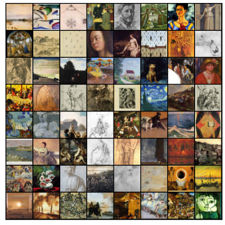
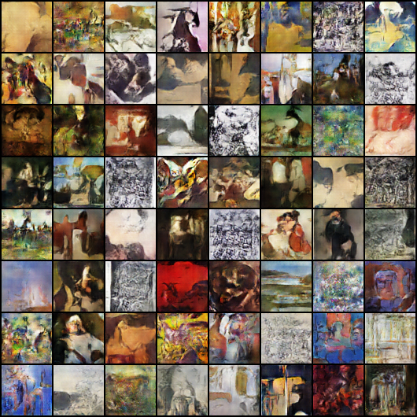

# trainGAN - generative art

## Introduction:

---

This mini-project on Generative art is trained by classical, renaissance paintings with the aid of deep learning and PyTorch to generate a myriad of visual generations that come with a sense of odd familiarity.

Generative Adversarial Network uses popular deep learning techniques such as convolutional neural networks to create appealing digital art, creating controversies in the creative community about the future of contemporary art and NFTs in the burgeoning new market.
The process entails automatically detecting and learning the regularities or patterns in the input data so that the model may be used to produce or output new examples that could have been drawn from the original dataset.

Generative modeling is an unsupervised learning task in machine learning that involves automatically discovering and learning the regularities or patterns in input data in such a way that the model can be used to generate or output new examples that plausibly could have been drawn from the original dataset.

## Working:

---

In GAN, there are two neural network models: Generator and Discriminator, competing against each other in a zero-sum game.
The Generative modeling is an unsupervised learning problem, but a brilliant aspect of the GAN architecture is that the generative model's training is framed as a supervised learning problem.

The generator is trained using a dataset to generate new examples and the discriminator model acts as a cop to deduce the integrity of the generated image as real or counterfeit. These two models are trained together and competed against each other until the Discriminator model is tricked around half of the time, indicating that the Generator model is producing credible results.

## Dataset:

---

The dataset used in this project is imported from Kaggle. The dataset "Best artworks of all time" is used for training puposes to generate abstract art.

## GAN Architecture:

---

    
  

 
Result:
----

**generated-image-final**

**generated-image-sample**

## Conclusion:

---

Amateurs to professionals are gravitating towards GAN over its interesting approach and plausible results and the same was employed to generate visual creations inspired by the given dataset.
